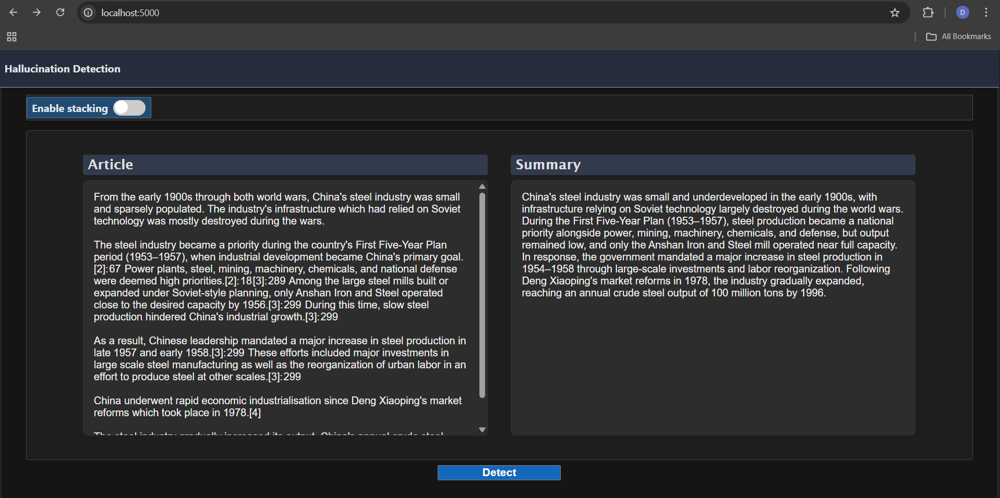
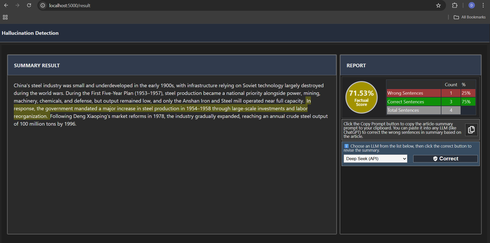

# AI Summary Hallucination Detection & Correction

A FastAPI-powered backend service for detecting and correcting hallucinations in AI-generated summaries. Built with production-ready Docker support and integrates advanced ML models for reliable summary validation. This involve giving original source text and it's AI generated summary as input so that model will be able to detect which part is exactly hallucinated.

---
## GUI Screenshots
### 1. Giving input to the application.



### 2. Output of the application.


---
##  Quick Start

### Prerequisites
- Docker & Docker Compose
- Python 3.9+ (if running locally without Docker)

### 1. Clone & Navigate
```bash
git clone <your-repo-url>
cd hallucination-detection
```


### 2. Run with Docker (Recommended)
```bash
# Build and start
docker build -t hallucination-detection .
docker run -p 8000:8000 --env-file .env hallucination-detection
```

### 3. Run Locally (Alternative)
```bash
# Install dependencies
pip install -r requirements.txt

# Start FastAPI server
uvicorn app:app --host 0.0.0.0 --port 8000 --reload
```

### 4. Access the GUI
- **GUI**: http://localhost:8000


---
##  API Endpoints

### 1. Hallucination Detection
```
POST /api/detect
```

**Request**:
```json
{
  "article": "Full source article text...",
  "summary": "AI-generated summary...",
  "arbiter": "on"
}
```

**arbiter**: `"on"` enables arbiter mode which involves using total of 3 heavy models.

**Response**:
```json
{
  "status": 200,
  "summary": "Summary with <xx>hallucinated</xx> tags...",
  "score": "0.87",
  "counts": [5, 2],
  "copy_prompt": "Prompt with article + tagged summary..."
}
```

### 2. Summary Correction
```
POST /api/correct
```

**Request**:
```json
{
  "article": "Source article text...",
  "tag_summary": "Summary with issues...",
  "model": "deepseek"
}
```

**Response**:
```json
{
  "status": 200,
  "available": 1,
  "corrected_summary": "Fixed summary...",
  "summary": "Summary with <xx>hallucinated</xx> tags...",
  "score": "0.87",
  "counts": [5, 2],
  "copy_prompt": "Prompt with article + tagged summary..."
}
```

### 3. Check Availability
```
POST /api/checkAvailability
```

**Response**:
```json
{
  "available": 1
}
```
Returns `1` if Deepseek available, `0` otherwise

##  Project Structure

```
.
├── app.py              # FastAPI main application
├── Routes.py           # API route definitions
├── utils.py            # Utility functions
├── Models/             # ML models and pipelines
├── Pipeline/           # Hallucination Detection .py files
├── dist/               # Build artifacts
├── Dockerfile          # Docker configuration
└── requirements.txt    # Python dependencies
```

---


##  Docker Commands

```bash
# Build image
docker build -t hallucination-detection .

# Run in background
docker run -d -p 8000:8000 --name hallucination-app --env-file .env hallucination-detection

# View logs
docker logs hallucination-app
```


##  Features

-  Real-time hallucination detection
-  Automated correction suggestions
-  Production-ready FastAPI backend
-  Docker containerization
-  Hugging Face model integration


